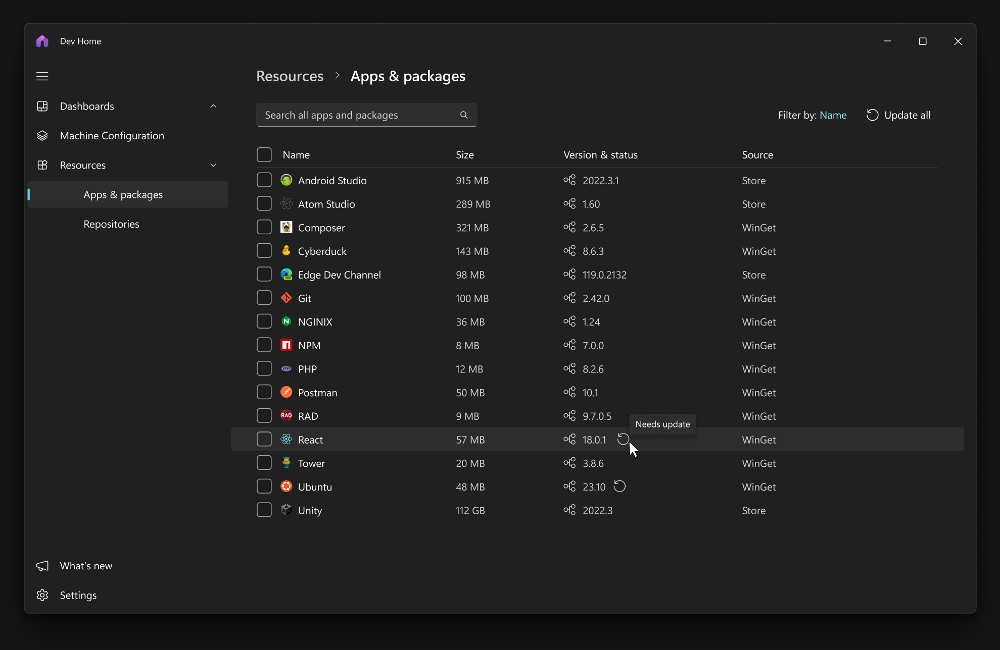
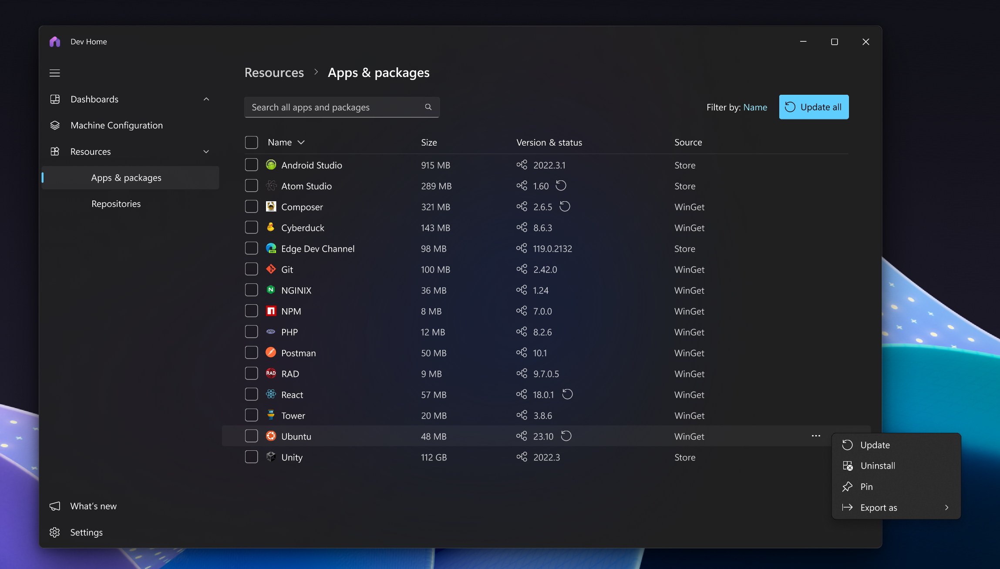

# Apps & Packages

## 1. Overview

### 1.1 Establish the Problem

Devs often need to install and manage a variety of tools and packages to get their work done. This can be a time consuming and frustrating process scattered across various UIs and CLIs.

### 1.2 Introduce the Solution

This new feature aims to create an all-in-one apps & packages management experience in Dev Home that allows you to manage your apps & package in a single, streamlined interface. From a unified interface, users can seamlessly handle package installation (exists in Dev Home already today), updates, and rollbacks for their winget packages. These enhancements will significantly boost efficiency, convenience, and control for software developers and power users, transforming the way they manage apps & packages.

### 1.3 Rough-in Designs

## 2. Goals & User Cans

### 2.1 Goals

| No. | Goal | Priority |
| --- | ---- | -------- |
| 1   |   Provide users with an easy and delightful experience to manage installed applications.    |     0     |
| 2   |   Incorporate advanced package management features such as version management, batch operations, automatic updates, and rollback capabilities.    |     0     |

### 2.2 Non-Goals

| No. | Non-Goal |
| --- | -------- |
| 1   |     This feature is not intended to replace the Windows Settings 'Apps > Installed' apps functionality.     |

### 2.3 User Cans Summary Table

| No. | User Can | Priority |
| --- | -------- | -------- |
| 1   |     A user can view application name, publisher, size, version, and source      |     0     |
| 2   |    A user can switch between different versions of a package       |    0      |
| 3   |    A user can select multiple applications at a time to perform bulk actions like update or uninstall       |    0      |
| 4   |   A user can search to find an application       |      0    |
| 5   |     A user can filter the page by update available      |      0    |
| 6   |    A user can sort the page by application name, publisher, size, and source.      |    0      |

## 3. User Stories

### 3.1 User story - Updating and Rolling Back Packages

A software developer wants to update a package to the latest version but finds that it has a bug affecting their system.

#### Job-to-be-done

1. Update a package to the latest version
2. Roll back to a previous version of a package

#### User experience

- A software developer launches Dev Home and navigates to the Apps & Packages page.
- They select the package that they want to update and click the Update button.
- They are prompted to confirm the update and clicks Yes. The package is updated to the latest version.
- They later find that the update has a security bug, so they go back to Dev Home to quickly revert to a previous version.
- They select the package they want to roll back and click on the version.
- They can see the available versions and select the version they want to roll back to.
- The package is rolled back to the previous version.

### 3.2 User story - Performing Bulk Actions

A software developer wants to clean up space on their machine and uninstall large packages they are no longer using.

#### Job-to-be-done

1. Sort packages by size  
2. Select multiple packages to uninstall in bulk

#### User experience

- User launches Dev Home and navigates to the Apps & Packages page.
- They click on the Size column to sort the packages by size.
- They select 3 packages they want to uninstall and click the Uninstall button.
- They are prompted to confirm the uninstall and click Yes. All 3 packages are uninstalled.

## 4. Requirements

### 4.1 Functional Requirements

#### Summary

This feature specification outlines the addition of a unified package management interface in Dev Home. It allows users to manage apps & packages from various package managers in a single, streamlined interface. With advanced features such as dependency and version management, batch operations, and rollback capabilities, the new interface provides a comprehensive package management solution. The result is a more efficient and user-friendly package management experience that substantially simplifies the workflow for software developers and IT professionals.

#### Detailed Functional Requirements

| No. | Requirement | Pri |
| --- | ----------- | --- |
| 1   |     The list of applications shown are winget or store applications (source: winget, msstore from winget list)      |  0   |
| 2   |     The management experience allows updating, version management, and uninstallation of winget or msstore packages.          |  0   |
| 3   |     Version selection allows a specific version to be installed from a drop-down menu.       |  0   |
| 4   |     A modification (version rollback, uninstall) to a package prompts for a confirmation.         |  0   |
| 5   |     Multiselect is available to apply bulk actions of update, and uninstall.   |  0   |
| 6   |     Packages can be sorted by name, size, update status, and source.      |  0   |
| 7   |     Packages can be filtered by name, size, update status, and source.  |  0   |
| 8   |     A search bar is available to search for a specific package.  |  0   |
| 9   |     Application data shown is name, size, installed version, update status, and source.       |  0   |
| 10  |     New applications installed via Dev Home, winget, or the Microsoft Store are automatically added to the list   |  0   |
| 11  |     When a package has a valid update, you can see there are updates available in the UI.  |  0   |
| 12  |     Packages can be imported with their settings with a Winget Configuration file   |  0   |
| 12  |     Packages can be imported with a winget import file [import Command](https://learn.microsoft.com/en-us/windows/package-manager/winget/import) |  1   |
| 13  |     Packages can be exported to a winget export file [export Command](https://learn.microsoft.com/en-us/windows/package-manager/winget/export)  |  1   |
| 14  |     Packages can be pinned so that they do not update or recommend new updates in the UI (dependent on [Add support for pinning to the COM API · Issue #4058 · microsoft/winget-cli](https://github.com/microsoft/winget-cli/issues/4058))  |  0   |
| 15  |     Packages can be exported with their settings to a Winget Configuration file [WinGet Settings export and import user settings · Issue #3693 · microsoft/winget-cli](https://github.com/microsoft/winget-cli/issues/3693) | 1 |
| 16  |     Other package managers can integrate into the UI (dependent on [Add support for other package managers · Issue #20 · microsoft/devhome](https://github.com/microsoft/devhome/issues/20)) | 2 |
| 17  |     Side by side support for apps (dependent on [Better support for Side by Side packages · Issue #2129 · microsoft/winget-cli](https://github.com/microsoft/winget-cli/issues/2129)) | 2 |
